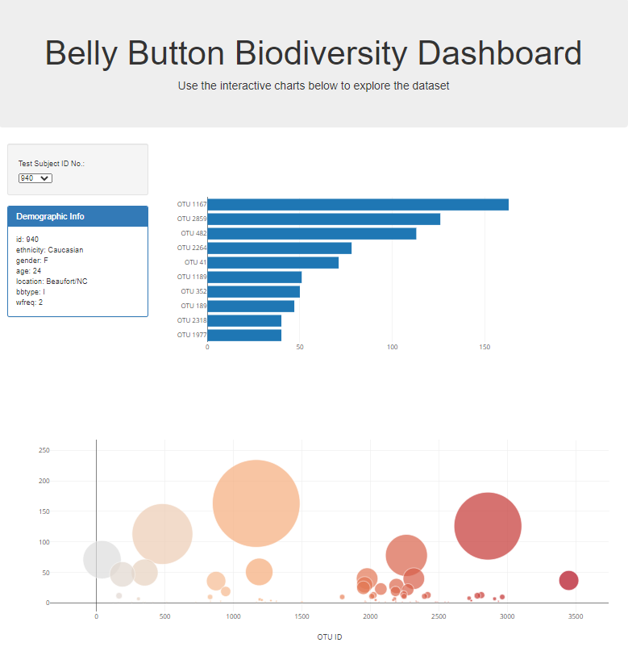

## Plot.ly_Challenge

# Belly Button Biodiversity

Welcome to my interactive dashboard. In this dashboard you can explore the [Belly Button Diversity dataset](http://robdunnlab.com/projects/belly-button-biodiversity/), which catalogs the microbes that cononize human navels. 

The dataset reveals that a small handful of microbial species (also called operational taxonomic units, or OTUs, in the study) were present in more than 70% of people, while the rest were relatively rare.

## Navigating the Website

To Naviage to the Interactive Dashboard, [Please click here](https://leslysok.github.io/Plot.ly_Challenge/)

To access and manipule the data, please select a Test Subject ID No. from the drop down field which you will find to the left of the page. It will default to ID No. 940. Once you select an ID No. you will notice that both the Bar Graph to the right and the bubble chart below update instantly along with some Demographic information in the table below the drop down.

